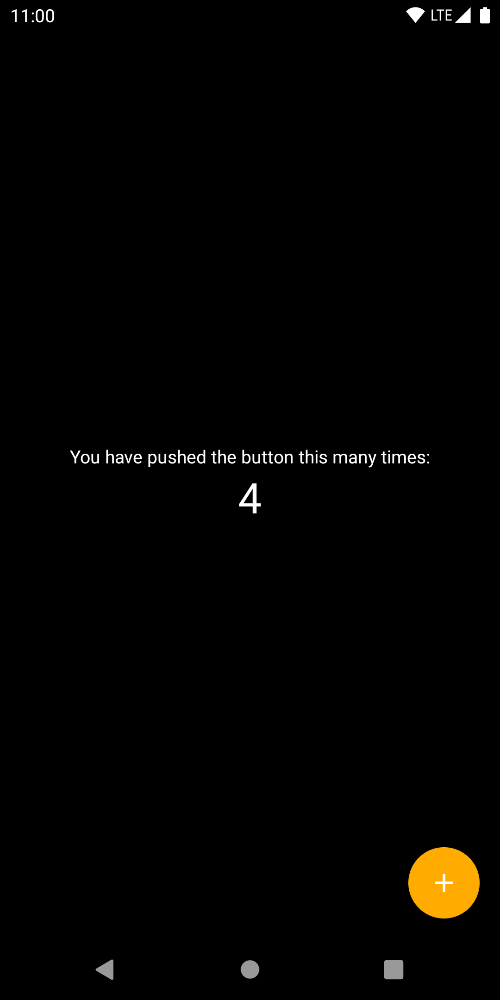

# android-redux-demo

A simple application that demonstrates the use of the redux library in Android.

## What is it?
This is a reference implementation of a single screen activity android application
with redux architecture. Middlewares and reducers are covered with tests.
The view contains no business logic and only cares about drawing himself with the provided data and dispatching actions when some event occurs. And yes, this app survives activity re-creation and DKA out of the box.

## This is how it looks like

   
   

## How can I get it in my application?
Redux library lives [here](https://gitlab.com/v.sulimov/android-redux-kotlin).

## License
<pre>
Licensed under the Apache License, Version 2.0 (the "License");
you may not use this file except in compliance with the License.
You may obtain a copy of the License at

   http://www.apache.org/licenses/LICENSE-2.0

Unless required by applicable law or agreed to in writing, software
distributed under the License is distributed on an "AS IS" BASIS,
WITHOUT WARRANTIES OR CONDITIONS OF ANY KIND, either express or implied.
See the License for the specific language governing permissions and
limitations under the License.
</pre>
